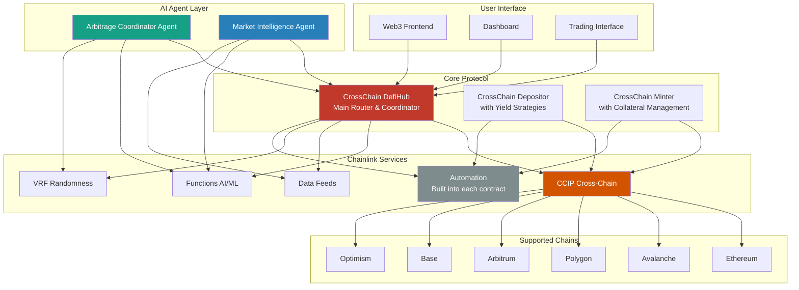
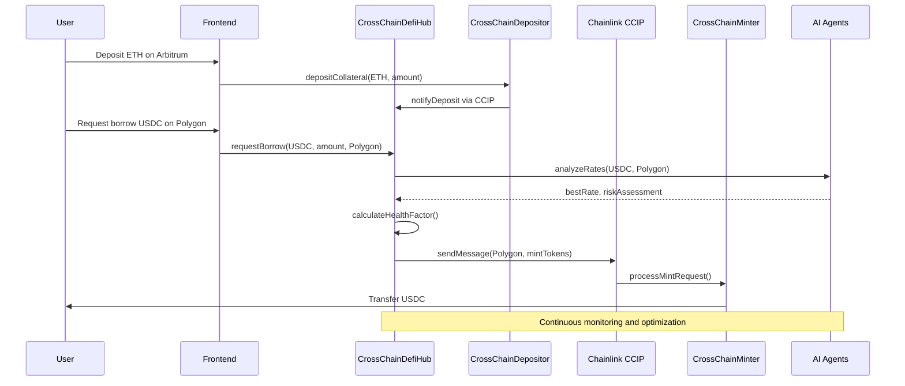
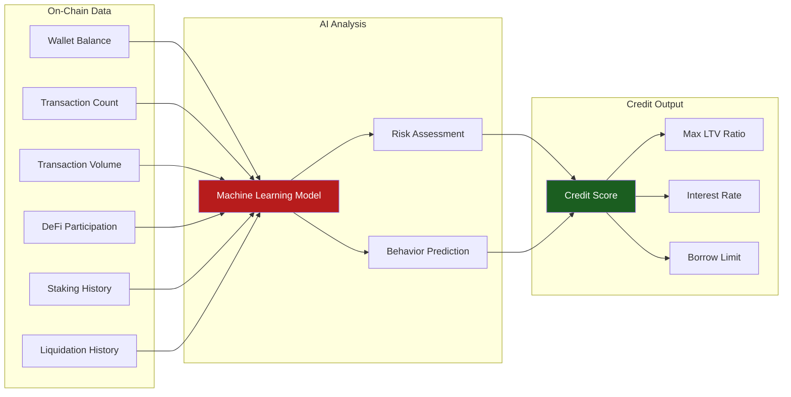
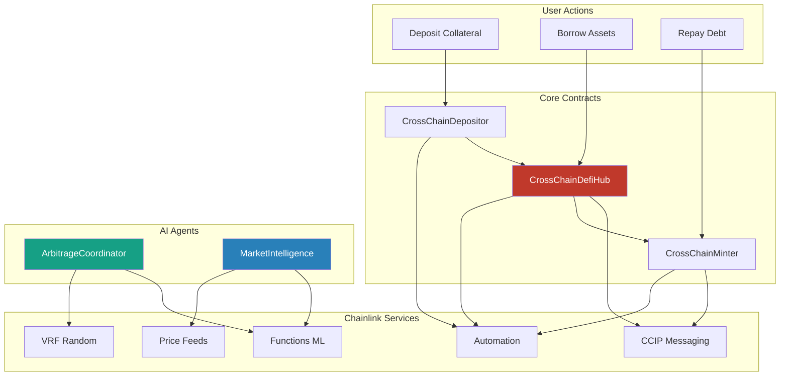

# CrossChainDefi: AI-Powered Cross-Chain DeFi Lending Protocol 🚀

## 🌟 Tagline
*"Unlocking Liquidity Across All Blockchains - Deposit Anywhere, Borrow Everywhere"*

---

## 📋 Table of Contents
- [Problem Statement](#-problem-statement)
- [Solution](#-solution)
- [Key Features](#-key-features)
- [Architecture Overview](#-architecture-overview)
- [Smart Contracts](#-smart-contracts)
- [AI Agent Integration](#-ai-agent-integration)
- [Chainlink Integration](#-chainlink-integration)
- [Getting Started](#-getting-started)
- [Frontend Application](#-frontend-application)
- [Technology Stack](#-technology-stack)

---

## 🎯 Problem Statement

The DeFi ecosystem faces significant challenges in cross-chain liquidity management:

### Core Problems:
1. **Fragmented Liquidity**: Assets locked on different blockchains cannot be efficiently utilized
2. **Complex Cross-Chain Operations**: Users need multiple transactions across different chains for simple operations
3. **Inefficient Capital Allocation**: Users can't optimize their collateral across multiple networks
4. **Limited Arbitrage Opportunities**: Cross-chain rate differences remain unexploited
5. **Manual Yield Optimization**: Users struggle to find the best lending/borrowing rates across chains

### Market Impact:
- **$200B+** in fragmented liquidity across major DeFi protocols
- **15-30%** rate differences between chains for same assets
- **2-5 hours** average time for cross-chain operations
- **High gas costs** for multi-chain portfolio management

---

## 💡 Solution

**CrossChainDefi** is an AI-powered cross-chain DeFi lending protocol that enables users to deposit collateral on one blockchain and borrow from another, all through a single interface.

### Core Innovation:
- **One-Click Cross-Chain Operations**: Deposit ETH on Arbitrum, borrow USDC on Polygon
- **AI-Powered Yield Optimization**: Intelligent agents find the best rates across all chains
- **Dynamic Credit Scoring**: ML-based creditworthiness evaluation using on-chain data
- **Automated Arbitrage**: Smart execution of cross-chain rate differences
- **Unified Liquidity Pool**: Aggregate liquidity from all supported chains

---

## 🔥 Key Features

### 🌐 Cross-Chain Operations
- **Multi-Chain Deposits**: Support for 8+ major blockchains
- **Instant Cross-Chain Borrowing**: Borrow on any supported chain using collateral from another
- **Seamless Token Bridging**: Automatic cross-chain token transfers via Chainlink CCIP
- **Unified Portfolio View**: Single dashboard for all cross-chain positions

### 🤖 AI-Powered Intelligence
- **Market Intelligence Agent**: Real-time analysis of lending rates across all chains
- **Arbitrage Coordinator**: Automated detection and execution of profitable opportunities
- **Yield Optimization**: AI-driven strategies for maximum returns
- **Risk Management**: Dynamic position monitoring and liquidation protection

### 💳 Advanced Credit System
- **On-Chain Credit Scoring**: ML analysis of wallet activity, transaction history, and DeFi participation
- **Dynamic LTV Ratios**: Credit score influences borrowing limits
- **Reputation Building**: Improve credit score through protocol participation
- **Privacy-Preserving**: All analysis done on-chain or via decentralized oracles

### 🔄 Automated Operations
- **Auto-Compounding**: Automatic yield reinvestment
- **Rebalancing**: Smart portfolio optimization across chains
- **Liquidation Protection**: Proactive position management
- **Gas Optimization**: Intelligent transaction timing and batching

---

## 🏗️ Architecture Overview

### System Architecture


### Cross-Chain Flow


### Credit Scoring System


---

## 📄 Smart Contracts

### Core Contracts

#### 1. CrossChainDefiHub.sol
**Role**: Main protocol coordinator and router
- Manages user profiles and health factors
- Coordinates cross-chain operations
- Integrates with all Chainlink services
- Handles liquidations and risk management

```solidity
// Key functions
function deposit(address token, uint256 amount, uint64 destinationChain)
function borrow(address token, uint256 amount)
function repay(address token, uint256 amount)
function liquidate(address user, address token, uint256 amount)
```

#### 2. CrossChainDepositor.sol
**Role**: Handles collateral deposits on source chains
- Multi-asset deposit support
- Yield strategy implementation
- Auto-compounding features
- Cross-chain messaging via CCIP

```solidity
// Key functions
function deposit(address token, uint256 amount, StrategyType strategy, bool autoCompound)
function withdraw(address token, uint256 amount)
function claimYield(address token)
function updateStrategy(StrategyType newStrategy, uint256 riskTolerance)
```

#### 3. CrossChainMinter.sol
**Role**: Manages token minting/burning on destination chains
- Collateralized token minting
- Health factor monitoring
- Liquidation handling
- Protocol token management

```solidity
// Key functions
function requestMint(address collateralToken, uint256 collateralAmount, uint256 mintAmount)
function requestBurn(uint256 burnAmount, address collateralToken, uint256 collateralAmount)
function liquidatePosition(address user, address collateralToken, uint256 maxAmount)
```

### AI Agent Contracts

#### 4. ArbitrageCoordinatorAgent.sol
**Role**: AI-powered cross-chain arbitrage coordination
- Cross-chain rate monitoring via CCIP messaging
- ML-based opportunity prediction using Chainlink Functions
- Automated execution strategies with VRF for diversification
- Risk-adjusted profit optimization and real-time price analysis
- Integration with all Chainlink services (CCIP, Functions, Data Feeds, VRF, Automation)

#### 5. MarketIntelligenceAgent.sol
**Role**: DeFi market analysis and yield optimization across chains
- Real-time lending rate analysis using Chainlink Functions for external API integration
- Protocol performance monitoring across multiple DeFi protocols (Aave, Compound, Venus, etc.)
- Cross-chain yield opportunity detection and arbitrage analysis
- Market trend prediction and automated rate updates via Chainlink Automation
- Comprehensive lending protocol tracking and risk assessment

### Contract Interactions


---

## 🤖 AI Agent Integration

### Arbitrage Coordinator Agent
- **Cross-Chain Arbitrage Detection**: Continuous scanning of lending rates across all supported chains
- **ML-Powered Predictions**: Uses Chainlink Functions for AI/ML computations to predict optimal execution timing
- **Risk Assessment**: Dynamic evaluation of arbitrage risks and rewards using VRF for strategy diversification
- **Automated Execution**: Smart contract-based arbitrage execution with cross-chain messaging via CCIP
- **Real-time Price Monitoring**: Integration with Chainlink Data Feeds for accurate pricing data

### Market Intelligence Agent
- **Protocol Analysis**: Deep analysis of lending protocols (Aave, Compound, Venus, Benqi, etc.) across all chains
- **Yield Optimization**: AI-driven yield farming strategies using Chainlink Functions for external API integration
- **Market Insights**: Real-time market condition analysis and lending rate comparisons
- **Opportunity Detection**: Identification of high-yield opportunities and cross-chain rate arbitrage
- **Automated Rate Updates**: Uses Chainlink Automation for regular protocol rate monitoring

### Built-in Automation
- **Smart Contract Automation**: Each core contract integrates Chainlink Automation directly
- **Automated Maintenance**: Regular protocol upkeep, liquidation checks, and yield compounding
- **Cross-Chain Coordination**: Automated cross-chain message processing and token transfers
- **Portfolio Rebalancing**: Automatic optimization of asset allocation across chains

### Integration Benefits
- **24/7 Monitoring**: Continuous market surveillance across all supported chains
- **Millisecond Execution**: Rapid opportunity capture with minimal latency
- **Risk Minimization**: AI-powered risk assessment and automated safeguards
- **Profit Maximization**: Optimal strategy selection based on real-time market analysis
- **Cross-Chain Intelligence**: Unified view of opportunities across the entire DeFi ecosystem

---

## ⛓️ Chainlink Integration

### CCIP (Cross-Chain Interoperability Protocol)
- **Cross-Chain Messaging**: Secure message passing between chains
- **Token Transfers**: Safe cross-chain asset movements
- **State Synchronization**: Consistent protocol state across chains

### Functions (Serverless Computing)
- **AI/ML Computations**: Credit scoring and market analysis
- **External API Integration**: Real-time data from DeFi protocols
- **Complex Calculations**: Advanced risk and yield calculations

### Data Feeds (Price Oracles)
- **Real-time Pricing**: Accurate asset valuations
- **Multi-Chain Support**: Price feeds across all supported chains
- **High Frequency Updates**: Up-to-date market data

### VRF (Verifiable Random Function)
- **Strategy Diversification**: Random strategy selection
- **Fair Liquidations**: Unbiased liquidation ordering
- **Security Enhancement**: Unpredictable execution patterns

### Automation (Keeper Network)
- **Automated Maintenance**: Regular protocol upkeep
- **Liquidation Execution**: Automated position liquidations
- **Yield Compounding**: Automatic reward reinvestment

---

## 🚀 Getting Started

### Prerequisites
- Node.js v18+ and npm/yarn/bun
- Git
- MetaMask or similar Web3 wallet
- Testnet ETH for various chains

### Quick Start

1. **Clone the Repository**
```bash
git clone https://github.com/mimimoneydev/cross-chain-defi.git
cd cross-chain-defi
```

2. **Install Dependencies**
```bash
# Install contract dependencies
cd contracts
bun install

# Install frontend dependencies
cd ../frontend-crosschaindefi
bun install
```

3. **Environment Setup**
```bash
# Copy environment templates
cp contracts/.env.example contracts/.env
cp frontend-crosschaindefi/env.template frontend-crosschaindefi/.env.local

# Edit environment variables
nano contracts/.env
nano frontend-crosschaindefi/.env.local
```

4. **Deploy Contracts**
```bash
cd contracts

# Compile contracts
bunx hardhat compile

# Deploy to testnet (e.g., Avalanche Fuji)
bunx hardhat run scripts/deploy.js --network fuji
```

5. **Start Frontend**
```bash
cd ../frontend-crosschaindefi
bun run dev
```

6. **Access Application**
Open [http://localhost:3000](http://localhost:3000) in your browser

### Environment Variables

#### Contract Environment (.env)
```env
# Private Keys (Use test keys only!)
ETHEREUM_PRIVATE_KEY=your_ethereum_private_key
POLYGON_PRIVATE_KEY=your_polygon_private_key
ARBITRUM_PRIVATE_KEY=your_arbitrum_private_key
AVALANCHE_PRIVATE_KEY=your_avalanche_private_key

# RPC URLs
ETHEREUM_RPC_URL=https://eth-sepolia.g.alchemy.com/v2/your-key
POLYGON_RPC_URL=https://polygon-mumbai.g.alchemy.com/v2/your-key
ARBITRUM_RPC_URL=https://arb-sepolia.g.alchemy.com/v2/your-key
AVALANCHE_RPC_URL=https://api.avax-test.network/ext/bc/C/rpc

# Chainlink Configuration
CHAINLINK_FUNCTIONS_SUBSCRIPTION_ID=your_subscription_id
CHAINLINK_VRF_SUBSCRIPTION_ID=your_vrf_subscription_id
```

#### Frontend Environment (.env.local)
```env
NEXT_PUBLIC_WALLET_CONNECT_PROJECT_ID=your_walletconnect_project_id
NEXT_PUBLIC_ALCHEMY_ID=your_alchemy_api_key
NEXT_PUBLIC_ENVIRONMENT=development
```

---

## 🎨 Frontend Application

### Technology Stack
- **Framework**: Next.js 14 with App Router
- **Styling**: Tailwind CSS + shadcn/ui components
- **Web3**: Wagmi + Viem for blockchain interactions
- **State Management**: Zustand for global state
- **UI Components**: Custom components with Radix UI primitives

### Key Features
- **Multi-Chain Wallet Connection**: Support for 8+ networks
- **Real-time Portfolio Dashboard**: Live position tracking
- **Cross-Chain Operations**: Intuitive deposit/borrow interface
- **AI Insights**: Market intelligence and opportunity alerts
- **Mobile Responsive**: Optimized for all devices

### File Structure
```
frontend-crosschaindefi/
├── app/                    # Next.js app directory
│   ├── layout.tsx         # Root layout
│   ├── page.tsx           # Home page
│   └── dashboard/         # Dashboard pages
├── components/            # React components
│   ├── ui/               # Base UI components
│   ├── web3/             # Web3-specific components
│   └── sections/         # Page sections
├── lib/                  # Utility libraries
│   ├── web3.ts          # Web3 configuration
│   └── utils.ts         # Helper functions
├── config/               # Configuration files
└── styles/              # Global styles
```

### Running the Frontend

```bash
cd frontend-crosschaindefi

# Development server
bun run dev

# Build for production
bun run build

# Start production server
bun run start

# Lint code
bun run lint
```

---

## 🛠️ Technology Stack

### Blockchain & Smart Contracts
- **Solidity**: Smart contract development
- **Hardhat**: Development environment and testing
- **OpenZeppelin**: Security-audited contract libraries
- **Chainlink**: Oracle services and cross-chain infrastructure

### AI & Machine Learning
- **Chainlink Functions**: Serverless AI computations
- **TensorFlow.js**: Client-side ML models
- **Custom ML APIs**: Advanced market analysis

### Frontend
- **Next.js 14**: React framework with App Router
- **TypeScript**: Type-safe development
- **Tailwind CSS**: Utility-first styling
- **shadcn/ui**: Modern UI component library
- **Metamask SDK**: Integrate MetaMask’s wallet functionalities authentication, transaction signing, and account management in mobile and web

### Infrastructure
- **Vercel**: Frontend deployment
- **Alchemy**: RPC providers
- **IPFS**: Decentralized storage
- **The Graph**: Blockchain indexing

### Development Tools
- **Bun**: Fast JavaScript runtime and package manager
- **ESLint**: Code linting
- **Prettier**: Code formatting
- **Husky**: Git hooks

---

## 📊 Deployment

### Supported Networks

| Network | Chain ID | Status | CCIP Support |
|---------|----------|--------|--------------|
| Ethereum Sepolia | 11155111 | ✅ Live | ✅ |
| Polygon Mumbai | 80001 | ✅ Live | ✅ |
| Arbitrum Sepolia | 421614 | ✅ Live | ✅ |
| Avalanche Fuji | 43113 | ✅ Live | ✅ |
| Base Sepolia | 84532 | ✅ Live | ✅ |
| Optimism Sepolia | 11155420 | 🚧 Coming Soon | ✅ |

### Contract Addresses

#### Avalanche Fuji (Hub Chain)
- **CrossChainDefiHub**: `0x...` (To be deployed)
- **ArbitrageCoordinatorAgent**: `0x...` (To be deployed)
- **MarketIntelligenceAgent**: `0x...` (To be deployed)

#### Ethereum Sepolia
- **CrossChainDepositor**: `0x...` (To be deployed)
- **CrossChainMinter**: `0x...` (To be deployed)

#### Polygon Mumbai
- **CrossChainDepositor**: `0x...` (To be deployed)
- **CrossChainMinter**: `0x...` (To be deployed)

### Deployment Scripts

```bash
# Deploy to all testnets
bun run deploy:testnets

# Deploy to specific network
bunx hardhat run scripts/deploy.js --network fuji

# Verify contracts
bunx hardhat verify --network fuji <contract_address>

# Setup cross-chain configuration
bun run setup:crosschain
```
